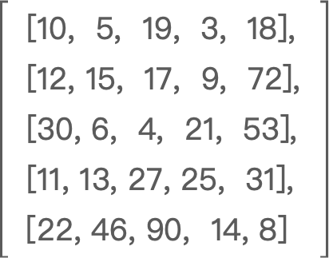
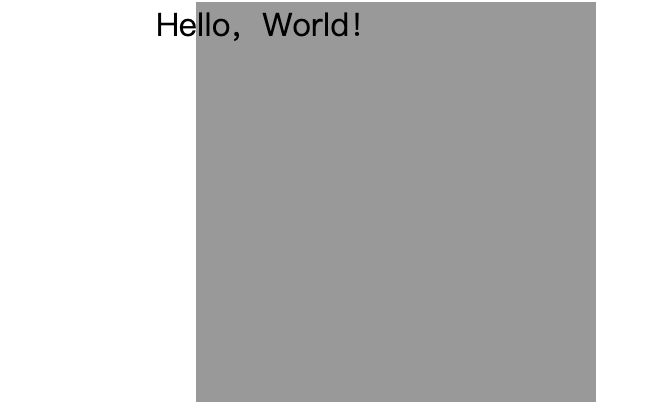
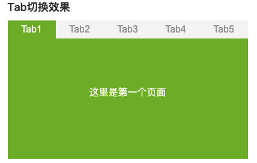
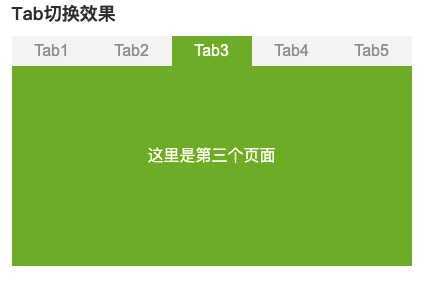

Tips:
> 《见习工程师》能力认证考点包含： 计算机通识（占比15～25%）、程序逻辑（占比20～30%）、Web基础（占比30～40%）、算法和Web综合（占比15～25%），共45题，时长100分钟
> 1-10 题，每题1分
> 11-40 题，除26题外，每题2分
> 26题4分
> 41题3分
> 42题3分
> 43题2分
> 44题6分
> 45题14分
> 一共100分

1. 二进制数111100000001001转十六进制数的结果是_________ H

【相关知识：进制转换】

2. 在TCP/IP的五层参考模型中，应用层对应OSI参考模型的应用层、表示层、______层

【相关知识点：OSI七层模型】

3. 要在以太网中传输1MByte大小的数据，最多会分成______个数据帧，假设每个数据帧大小为64字节

【相关知识点：网络协议】

4. 
```http
HTTP/1.1 200 OK
Date: Mon, 27 May 2021 12:28:53 GMT
Server: Apache
Last-Modified: Wed, 22 May 2021 19:15:56 GMT
ETag: "34aa387-d-1568eb00"
Accept-Ranges: bytes
Content-Length: 51
Vary: Accept-Encoding
Content-Type: text/plain
```

上面HTTP的请求成功了

【相关知识点：HTTP请求报文】

A 正确
B 错误

5. ac.csdn.net是一级域名

【相关知识点：域名解析】

A 正确
B 错误

6. HTTPS是由HTTP和____________协议构建的更为安全的网络协议
【相关知识点：网络协议】

7. 178.18.29.31/18的子网掩码是____________

【相关知识：网段划分】

8. 请问下面的二维数组array[3][1]的数值是什么（数组下标从0开始）？



【相关知识点：数据结构常识】


9. 在星型网络拓扑结构中，每个节点都可以与其他多个节点通信

【相关知识点：网络拓扑】

A 正确
B 错误

10. ::1/128是IPv6的环回地址的缺省写法

【相关知识点：IPv6】

A 正确
B 错误

11. 在Windows上，如果想查看本机IP地址，可以用哪个命令？

【相关知识点：常用网络命令】

12. 域名总长度不能超过________个字符

【相关知识点：域名解析】

13. 2021年7月3日，由国防科技大学研制，部署在国家超级计算天津中心的_____________获得SSSP Graph500（单源最短路径）世界第一和BIG Data Green Graph500（大数据图计算能效）世界第一的佳绩

【相关知识点：科技前沿】

14. 2020年12月4日，由______________成功构建出76个光子的量子计算原型机“九章”

【相关知识点：科技前沿】

15. 2021年6月1日，一位虚拟数字学生在北京正式亮相并进入清华大学计算机科学与技术系知识工程实验室学习，TA叫____________

【相关知识点：科技前沿】

16. 表达式 `Math.____(3.4589)`计算结果为3，则空格处应该填？

【相关知识点：JS内置对象Math】

17. 想要以下代码运行符合预期则空格处应该填什么整型数字？

```javascript
for (var i=0; i < ___; i++) {
	console.log(i)
}
```

预期输出结果：
0
1
2
3
   
【相关知识点：for循环】

18. 想要以下代码运行符合预期则空格处应该填？

```javascript
for (var i = 0; i < 6; i = i + ____) {
  console.log(i)
}
```

预期输出结果：
0
2
4

【相关知识点：for循环】

19. 想要以下代码运行符合预期则空格处应该填？

```javascript
var a = Math.___(3, 3)
console.log(a)
 ```
 
预期输出结果：
27
   
【相关知识点：JS内置对象Math】


20. 想要以下代码运行符合预期则空格处应该填？

```javascript
for (var i = 0; i < 10; i++) {
	if (i ______ 3 === 0 && i !== 6) {
		console.log(i)
	}
}
```

预期输出结果：
0
3
9

【相关知识点：for循环/if分支】

21. 表达式1 + 3 + '7' + 8的计算结果是________

【相关知识点：隐式类型转换/字符串运算】

22. JavaScript语言中，需要使用Math库来生成0到1之间伪随机浮点数，补全代码片段

```javascript
var num = Math.______()
console.log(num)
```

【相关知识点：JS内置对象Math】

23. 在JavaScript中以下字符串都可用作变量名

```
-abc
4ef
apple_2
var
name
```

【相关知识点：变量名规则】

A 正确
B 错误 

24. 要想以下JavaScript代码符合预期，空格处应该填写什么？

```javascript
var student = {name:'xiaoming', age:18}
if (student.school === ____) {
	console.log（'该学生没有录入学校信息'）
}
```

预期输出结果：
该学生没有录入学校信息
   
【相关知识点：对象属性】

25. 要想以下JavaScript代码符合预期，空格处应该填写的字符串是？

```javascript
var str = "画家:我的花名叫______画家"
console.log(str)
```

预期输出结果：
画家:我的花名叫"画家
	
【相关知识点：字符串定义/转义字符】

26. 要想以下JavaScript代码符合预期，空格处应该的填写什么？

```javascript
function foo(str) {
	return str.split("").map(function (item) {
		return item.repeat(3)
	}).join("")
}
console.log(foo(_____))
```

预期输出结果：
yyyooouuu
	
【相关知识点：函数定义与调用/字符串常用方法/数组常用方法】

27. 在HTML中一般用哪个语义化标签表示导航栏？

【相关知识：语义化标签】

28. head中用来引入外部CSS文件或者是小图标的标签是什么，补全代码？

```html
<_______ href="./css/index.css" rel="stylesheet" />
```

【相关知识： head头】

29. 要实现当鼠标悬停到a标签时移除下划线，请补齐选择器

```html
a:________{text-decoration: none;}
```

【相关知识：伪类选择器】

30. 将图片的宽度设置为450px，高度设置为500px，

```html

```

【相关知识：img标签属性】

31. 怎么用input标签创建一个表单重置按钮？请补齐这段代码

```html
<input type="________" />
```

【相关知识：input标签属性】

32.
以下元素全部都是块级元素
```
div
p
form
ul
li
dl
dd
```

【相关知识：块级元素】

A 正确 
B 错误
 
33. 给`a`标签中的`href`设置什么类型的值可以打开系统电子邮件应用，请补齐这段代码

```html
<a href="______xxx@csdn.net">邮件</a>
```

【相关知识：a标签mailto属性】

34. 要让鼠标停留在a标签上出现提示信息，请补齐这段代码

```html
<a href="https://www.csdn.net/" ________="CSDN首页">CSDN</a>
```

【相关知识：title属性】

35. 现有如下代码片段，请问标准盒模型中div的实际占位高度是________px？

```css
div {
	width: 100px;
	height: 100px;
	margin-top: 10px;
	padding-top: 10px;
}
```

【相关知识：盒模型】

36. 用户通过点击按钮打开新窗口，请补齐下面代码：

```html
<input type="button" value="打开新窗口" onclick="_________('action.jsp')" />
```

【相关知识：window 对象】

37. 现需要使文本不换行,请补全代码片段

```html
<style>
p { 
    width: 50px;
    white-space: ________;
}
</style>

<body>
    <p>CSDN能力认证</p>
</body>
```

【相关知识：white-space属性】

38. div需要横向平铺背景图片001.png，请补全代码片段

```css
div {
	background: url(images/001.png) ________  left top;
}
```
【相关知识：background属性】

39. 现要求“Hello，World！”文本相对于div向左偏移20px，显示效果如下图，请补全代码片段



```html
<body style="padding-left: 100px; margin: 0px;">
<div style="position: relative; width: 200px; height: 200px; background-color: #999999;">
    <p style="position: relative; left: ________px;">Hello，World！</p>
</div>
</body>
```

【相关知识：定位属性】

40. 想要选择类名为coffee的li元素相邻的第一个li元素，设置字体和字体颜色样式，请补齐这段代码

```html
<style>
.coffee_______li {
    color: #000000;
    font-family: Microsoft YaHei;
}
</style>
<ol>
    <li class="coffee">Coffee</li>
    <li>Tea</li>
    <li>Milk</li>
</ol>
```

【相关知识：CSS选择器】

41. DOM节点操作中，已获取某个a元素标签并赋值给变量a，如何获取a元素中的链接地址？请补全代码片段

```javascript
a.___________('href')
```

【相关知识：DOM节点操作】

42. 补全代码，实现点击不同栏目显示对应内容的功能

```html
<style>
  .detail { display: none; }
  .show { display: block; }
</style>

<button class="nav">栏目1</button>
<button class="nav">栏目2</button>
<p class="detail show">内容1</p >
<p class="detail">内容2</p >

<script>
  var tab = document.querySelectorAll('.nav'); 
  var detail = document.querySelectorAll('.detail');
  for (var i = 0; i < tab.length; i++) {
    tab[i].idx = i;
    tab[i].onclick = function () {
      for (var j = 0; j < detail.length; j++) {
        detail[j].classList.remove('show');
      }
      detail[this.________].classList.add('show');
    }
  }
</script>
```

【相关知识：DOM节点操作】

43. 当输入框内容发生改变，鼠标离开输入框的时候，将输入框中的内容输出到页面中，补全代码

```html
<script>
    function myFunction() {
        var comment = document.getElementById("comment");
        var content = document.getElementById("content");
        content.innerHTML = comment.value
    }
</script>
<label for="comment">请输入：</label>
<input type="text" id="comment" _____________="myFunction()">
<p id="content"></p>
```

【相关知识点：DOM节点操作】

44. 使用 JavaScript 数组 arrList 完成下列需求 （算法编程题，完成度越高，得分越高）

	1. 先将每个奇数存到 oddRepeat 数组中、将每个偶数存到 evenRepeat 数组中（数字不去重，出现几次写几次）
	2. 再对整个数组进行去重并执行排序操作（数字从大到小排序，不允许使用 JavaScript 内置函数 sort 实现）
	3. 最后，将排序后的数据保存到数组 list 中
如下所示：

```javascript
var arrList = [1, 9, 0, 2, 1, 6, 8, 11, 0, 5, 18, 1, 26, 11, 8, 2, 3, 5, 18]
// 最终结果
{
  list: [ 26, 18, 11, 9, 8, 6, 5, 3, 2, 1, 0 ],
  evenRepeat: [ 0, 2, 6, 8, 0, 18, 26, 8, 2, 18 ],
  oddRepeat: [ 1, 9, 1, 11, 5, 1, 11, 3, 5 ]
}
```

45. 请实现以下图片的效果（按照步骤给分）
手动点击时完成Tab切换即可（完成度越高，得分越高）



