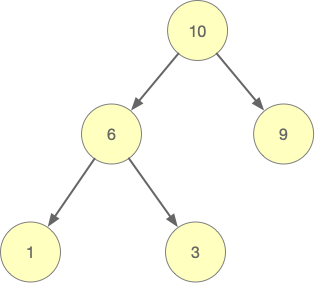
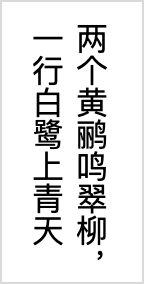
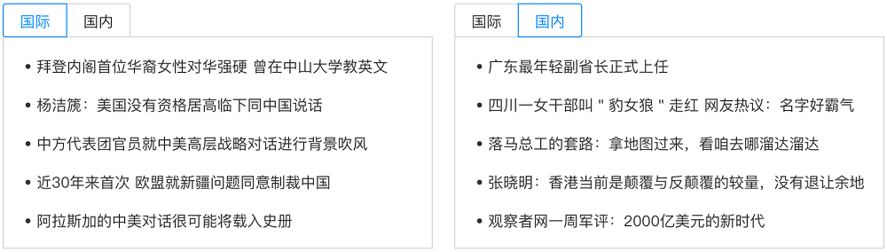

Tips:

> 《见习工程师》能力认证考点包含： 计算机通识（占比15～25%）、程序逻辑（占比20～30%）、Web基础（占比30～40%）、算法和Web综合（占比15～25%），共45题，时长100分钟。
> 
> 1-10 题，每题1分;
> 11-40 题，除26题外，每题2分;
> 26题4分;
> 41题3分;
> 42题2分;
> 43题3分;
> 44题6分;
> 45题14分;
> 一共100分。

1. 二进制数10010与十进制数37相加，最后再将结果转换为十六进制数，那么这个十六进制数是__H

【相关知识：进制转换】

2. 如果二进制数字“11001001__”采取奇校验，那么下划线（校验位）处应该填什么？

【相关知识：数据校验】

3. 视频码率通俗地说就是采样率，采样率越大，处理后的视频就越清晰。码率的计算公式为：码率(kbps，千位每秒)=文件大小(KB) * 8 / 时间(秒)。一个大小为2.2GB，时长为150分钟的MKV视频文件，它的码率是__kbps

【相关知识：多媒体文件格式】

4. 4G宽带网络的下行带宽介于100Mbps～150Mbps之间。假设一直用4G峰值带宽下载一部4.3GB的centos.iso镜像文件，需要大约180秒

【相关知识：存储与带宽容量】

  A 正确
  B 错误

5. 如果开启了防火墙，那么127.0.0.1、localhost和本机IP，这三者中____能ping通

【相关知识：IPv4、网段划分】

6.

```http
HTTP/1.1 200 OK
Date: Mon, 27 June 2021 15:29:31 GMT
Server: Apache
Last-Modified: Wed, 22 June 2021 19:15:56 GMT
Accept-Ranges: bytes
Content-Length: 168
Vary: Accept-Encoding
Content-Type: text/plain
```

上面HTTP响应报文中传输的数据是____________字节

【相关知识：HTTP请求报文】

7. 172.16.28.189/17的子网掩码是____

【相关知识：网段划分】

8. 下面的二叉树是AVL树

 

【相关知识：数据结构常识】

A 正确
B 错误

9. 现需要为域名解析添加一条A记录：`*.csdn.net -> 39.106.226.142`，那么以下域名`ac.csdn.net`指向哪个IP地址，`ac.csdn.net` -> ____ ？ 

【相关知识：域名相关知识】

10. 在一次HTTP请求中，URL编码的功能是在OSI七层模型的__层完成的 

【相关知识：OSI七层模型】

11. http、https、telnet、ftp这四个协议默认的端口号分别是80、443、23、__

【相关知识：常用网络命令和端口】

12. ____型网络拓扑结构是仅与自己的左右节点通信，并且通信数据流还是单向的 

【相关知识：网络拓扑】

13. 现在脑机接口的实现方式大致分为两类：一类是侵入式，另一类为非侵入式的。实验人员佩戴脑机交互头盔完成设备遥控，属于____式。

【相关知识：科技前沿】

14. 我国科学家构建的量子计算原型机“九章”，这类计算机是冯诺依曼架构？ 

【相关知识：科技前沿】

A 正确
B 错误

15. 在物联网领域中，窄带物联网（Narrow Band Internet of Things, NB-IoT）是物联网的一个重要分支，它构建于蜂窝网络，只消耗大约___kbps 

【相关知识：科技前沿】

16. 要想以下JavaScript代码符合预期，空格处应该填什么？

```javascript
var arr = ['a', 'b', 2, 5, 'c']
for (var item _____ arr) {
  console.log(item);
}
```

预期输出结果：
0
1
2
3
4

【相关知识点：for-in循环】

17. 要想以下JavaScript代码符合预期，空格处应该填什么**整形数字**？

```javascript
var a = 8
var b = 0
if (a > 5) {
  b = 2
} else if (a > 4) {
  b = 3
}
if (b === ___) {
  console.log('hello')
}
```

预期输出结果：
hello

【相关知识点：if-else if-else分支】


18. 以下JavaScript代码预期，空格处应该填什么？

```javascript
var a = 9
var b = '2'
var c = a - b
if (c === ___) {
  console.log('hello')
}
```

预期输出结果：  
hello

【相关知识点：隐式类型转换】


19. 要想以下JavaScript代码符合预期，空格处应该填什么？

```javascript
var a = Math._____(-234.38)
console.log(a)
```

预期输出结果：
-235

【相关知识点：Math内置对象常见方法】


20. 要想以下JavaScript代码符合预期，空格处应该填什么？

```javascript
var a = "abbcdefgh".________('b')
console.log(a)
```

预期输出结果：
1

【相关知识点：字符串常见方法】


21. 要想以下JavaScript代码符合预期，空格处应该填什么？

```javascript
var str = "diagrams"
console.log(str._____(2))
```

预期输出结果：
a

【相关知识点：字符串常见方法】


22. 要想以下JavaScript代码符合预期，空格处应该填什么？

```javascript
var arr = [795, [0, 1, 2], 8];
console.log(arr._____())
```

预期输出结果：
8

【相关知识点：数组常见方法】


23. 要想以下JavaScript代码符合预期，空格处应该填什么**数组属性**？

```javascript
var arr = [4,8,6,[3,4,9],4]
console.log(arr.____)
```

预期输出结果：
5

【相关知识点：数组常见属性】


24. 要想以下JavaScript代码符合预期，空格处应该填什么？

```javascript
var person = new Object();
person.name = 'ZhangSan';
person.sayHello = function() {
  console.log('Hi! I\'m ' + _____.name + '.');
}
person.sayHello()
```

预期输出结果：
Hi! I'm ZhangSan.

【相关知识点：对象/this】


25. 要想以下JavaScript代码符合预期，空格处应该填什么？

```javascript
var p = {
  name : 'Bob',
  age : 21,
};
console.log(p['_____'])
```

预期输出结果：
21

【相关知识点：对象属性】


26. 要想以下JavaScript代码符合预期，空格处应该填什么？

```javascript
function foo(str) {
​  var n = 3
​  var strArr = ['a', 'b', 'c', 'd', 'e', 'f']
​  var newStr = ''
​  for (var i of str.split("")) {
  ​  if (strArr.indexOf(i) === -1) {
  ​   newStr += i
  ​  } else {
    ​  var s = (strArr.indexOf(i) + n) % strArr.length
    ​  newStr += strArr[s]
  ​  }
​  }
return newStr
}
console.log(foo("____"))
```

预期输出结果：
afb

【相关知识点：数组常见方法/字符串常见方法/for-of循环/取模运算/分支】


27. 实现点击文字，单选框就可以选中的效果，请补全代码片段

```html
<________ for="male">男</label>
<input type="radio" name="sex" id="male" value="male"><br>
```

【相关知识：HTML标签】


28. 现表单内有个提交按钮，点击后自动提交表单请求，请补全代码片段

```html
<input type="________" value="提交">
```

【相关知识：input标签属性】


29. 现需要实现古代书写从上到下，从右至左的效果（如图所示），请补全代码片段



```html
<p style="________:vertical-rl;height:100px;">两个黄鹂鸣翠柳，一行白鹭上青天</p>
```

【相关知识：CSS文本属性】 


30. 现需要设置a的顶部外边距，请补齐代码片段

```css
a {
  display:________;
  margin-top:10px;
}
```

【相关知识：display属性】


31. 现需要导入外部样式表，请补全代码片段

```html
<head>
  <meta charset="utf-8">
  <link type="text/css" rel="________" href="style.css" />
</head>
```

【相关知识：CSS引入方式】


32. 现有如下代码片段，请问标准盒模型中div的实际占位高度为______px

```css
div{
  width:100px;
  height:100px;
  margin:5px;
}
```

【相关知识：盒模型】


33. 现有如下代码片段，hello world的最终显示颜色为color:________

```html
<style>
.text1 {color:#999998 !important;}
#son {color:#00ff00;}
</style>
<body>
  <p id="son" class="text1" style="color:#ff0000;">hello world</p>
</body>
```

【相关知识：CSS优先级】


34. 现需要设置div的背景图片，请补全代码片段

```html
<div style="background-image:_____('./bg.png');height:100px;width:100px;"></div>
```

【相关知识：background属性】


35. 现需要实现首行文本为红色，请补全代码片段

```html
<style>p::_______{color: red;}</style>
<p>
CSDN软件工程师能力认证对标名企技术标准<br/>
校招/转岗/加薪必备。
</p>
```

【相关知识：伪元素选择器】


36. 划去内容不是质数的li，补全横线处数字

```html
<style>
  .item:nth-last-child(________) {
    text-decoration: line-through;
  }
</style>
<ul class="list">
  <li class="item">2</li>
  <li class="item">3</li>
  <li class="item">5</li>
  <li class="item">8</li>
</ul>
```

【相关知识：伪类选择器】


37. 使类名为top的div定位在类名为bottom的div上方，横线处可填写的最小整数是？

```html
<style>
  .box {
    position: relative;
  }
  .top {
    position: absolute;
    width: 200px;
    height: 200px;
    background: red;
    z-index: _______;
  }
  .bottom {
    position: absolute;
    width: 400px;
    height: 400px;
    background: blue;
    z-index: 9;
  }
</style>
<div class="box">
  <div class="top"></div>
  <div class="bottom"></div>
</div>
```

【相关知识：层级属性】


38. 将div中的第二个p元素文字缩进设置为20px，横线处应该填写的数字是？

```html
<style>
  div p:nth-of-type(____) {
    text-indent: 20px;
  }
</style>
<div>
  <span>原则1</span>
  <p>原则2</p>
  <p>原则3</p>
</div>
```

【相关知识：伪类选择器】


39. 现需要定义value的最大长度，请补全代码片段

```html
<input type="text" name="name"  ________="10">
```

【相关知识：input标签属性】


40. 现需要实现点击删除按钮时弹出提示

```html
<button id="delete">删除</button>
<script>
  var btn = document.getElementById('delete');
  btn.___________('click', showPublish);
  function showPublish() { 
    alert('已删除');
  }
</script>
```

【相关知识：DOM节点操作-事件】


41. 现需要执行js，实现返回顶部的功能，请补全代码片段

```javascript
window.________(0, 0)
```

【相关知识：window对象】


42. 鼠标双击当前行li元素时，可将当前双击的文字内容改为绿色，补全代码

```html
<ul class="list" title="备忘录">
<li><span>下班买牙膏</span></li>
<li><span>明天要开会</span></li>
</ul>
<script>
var listItems = document.querySelectorAll('.list li')
for (var idx = 0; idx < listItems.length; idx++) { 
  listItems[idx].addEventListener('____', function() { 
    this.style.color = 'green' 
  }) 
}
</script>
```


43. 点击提交，实现备忘录的添加功能（可获取输入框中的值并将其添加到列表的最后一项），依次补全代码

```html
<input type="text" class="username"><button class="submit">提交</button>
<ul class="list" title="备忘录">
​	<li>下班买牙膏</li>
​	<li>记得拿快递</li>
</ul>
<script>
var username = document.querySelector('.username')
var btn = document.querySelector('.submit')
var list = document.querySelector('.list')
btn.addEventListener('click', function() {
  var last = document.____Element('li')
  last.innerText = username.value
  list.appendChild(last) 
})
</script>
```

【相关知识：DOM节点操作】


44. 使用javascript将下列字符串20-31位截取并在原字符串中去掉截取出来的这一段，反转后转大写英文并拼接在字符串最后一起输出 注意：20-31位已不在原来的字符串中，将他们反转拼接在最后。（完成度越高得分越高）

```javascript
var str = "There are surprises dlrow olleh in the tasks you are going to accomplish."
```

45. 不利用第三方UI组件库以及框架的前提下，使用html/css/js手写完成下列效果（完成度越高，得分越高）

